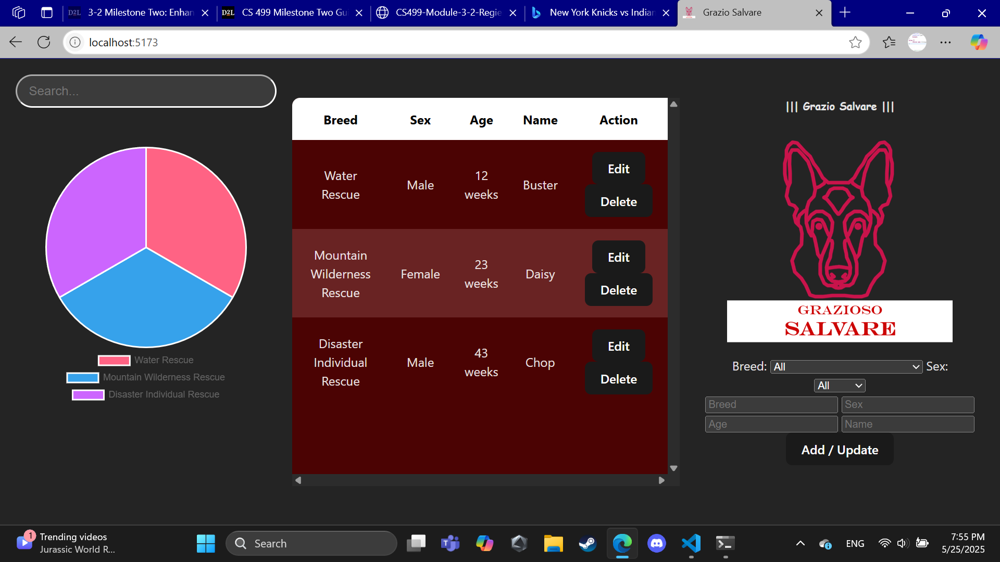
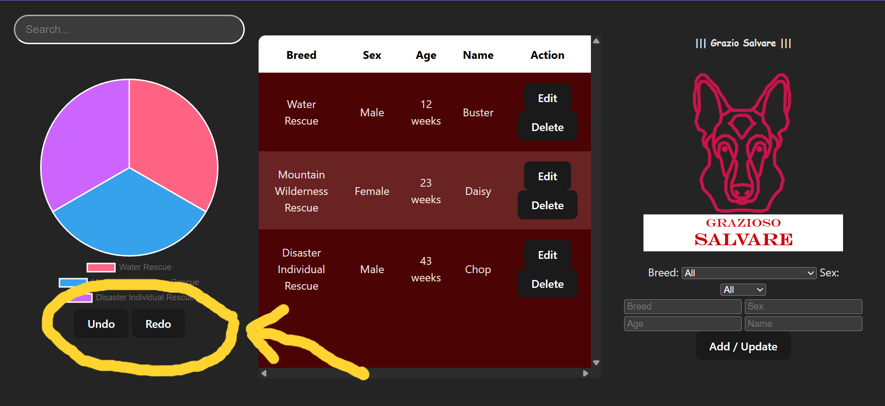

        <h1>Code Review</h1>
        <iframe width="700" height="425" src="https://www.youtube.com/embed/Fy_drKCJWU4?si=r0HRbUd_x-LhSVq2" 
                title="YouTube video player" frameborder="0" 
                allow="accelerometer; autoplay; clipboard-write; encrypted-media; gyroscope; picture-in-picture; web-share" 
                referrerpolicy="strict-origin-when-cross-origin" allowfullscreen>
        </iframe>

        <h1>Original Aritfact</h1>
        <h4>All enhancements are based on this artifact</h4>
        <a href="https://github.com/averylr25/averylr25.github.io/blob/main/Original-CS340-Artifact-Regier.zip">Github Link</a>

        <h1>Enhancement 1:</h1>
        <h3>Software Design and Engineering</h3>
        <a href="https://github.com/averylr25/averylr25.github.io/blob/main/CS499-Enhancement1.zip">Github Link</a>
        </img>
        <h4>
                1.	Briefly describe the artifact. What is it? When was it created?
                The artifact is the Grazio Salvare React page which is an alternative to the original artifact which was based on python. The overall program aims to utilize a database, CRUD, and then to display that data to the user in a dashboard for the purpose of allowing the company, Grazio Salvare, to adopt dogs that could be used in rescue operations. This artifact was created about a year ago.
                2.	Justify the inclusion of the artifact in your ePortfolio. Why did you select this item? What specific components of the artifact showcase your skills and abilities in software development? How was the artifact improved?
                        This artifact will be included in the ePortfolio as it highlights the ability to use multiple languages and libraries in order to make a clean and coherent piece of code. I selected this item because it seemed like the most impactful for me to do as being able to convert languages is an essential skill that everyone needs to know. The specific component that highlights my skills is the ability to convert the python code to JavaScript with similar, yet distinct, mannerisms. The artifact was improved as the UI was made to look better as well as allowing for a more solidified filtration system compared to the original.
                3.	Did you meet the course outcomes you planned to meet with this enhancement in Module One? Do you have any updates to your outcome-coverage plans?
                        I feel as though I was able to achieve the course outcomes by using tools and skills to create and deliver value which was the intended standard I had wanted to meet this module. Overall, I think I am on pace as the final milestone should improve the security aspect which would leave the algorithms for the last outcome that needs addressed.
                4.	Reflect on the process of enhancing and modifying the artifact. What did you learn as you were creating it and improving it? What challenges did you face?
                The biggest issue for me was by far time as I had been struggling in another class whilst taking this one which reduced the overall time for planning. Additionally, I had no knowledge of React and very limited knowledge of CSS and HTML which had caused me to have to learn as I go. Accordingly, this lack of knowledge had allowed me to further learn both html and css more which gives me confidence for later iterations of this project. Otherwise, to combat this lack of knowledge, a lot of research had to be done such as the implementation of tables and CRUD features in order to make the project run better. I also know I have some unneeded imports in the project as I was looking for different ways to build the baseline, such as importing a mapping feature despite that never actually being implemented. This does lead to some of my styling to have unused variables which can highlight sloppy code.
        </h4>

        <h1>Enhancement 2:</h1>
        <h3>Algorithms and Data Structures</h3>
        <a href="https://github.com/averylr25/averylr25.github.io/blob/main/CS499-Enhancement2.zip">Github Link</a>
        </img>
        <h4>
                1.	Briefly describe the artifact. What is it? When was it created?
                The artifact is the CS340 Grazio Salvare CRUD dashboard assignment where the goal was to allow the user to manipulate and display data for both analysis and visualization purposes. The original artifact allows the user to create, read, update, and delete data as well as display the information in a filterable/sortable data table. This artifact was originally created about one year ago.
                2.	Justify the inclusion of the artifact in your ePortfolio. Why did you select this item? What specific components of the artifact showcase your skills and abilities in algorithms and data structure? How was the artifact improved?
                While the total enhancements can be improved, the undo/redo using the stack allows for the CRUD features to be more user friendly as they can fix potential errors they may have committed. I selected this item because I wanted to build one bigger project rather than three separate ones in order to showcase a “larger” scale upgrade. The ability to use the stack to undo/redo errors shows the ability to use the data structure to provide a more user-friendly feel to the project which shows the ability to understand both user-friendliness as well as the ability to understand how data structures work. 
                3.	Did you meet the course outcomes you planned to meet with this enhancement in Module One? Do you have any updates to your outcome-coverage plans?
                I generally met the ability to algorithmic principles as I had created a stack-based data structure which allows the program to store its states in a nest for the purpose of allowing the user to redo/undo alterations. Overall, my course outcome-coverage plans are still the same as I feel like I have a solid gameplan on what different assignments address each need.
                4.	Reflect on the process of enhancing and modifying the artifact. What did you learn as you were creating it and improving it? What challenges did you face?
                The biggest challenge for me was finding a way to improve the data structure/algorithms for the project since my initial plan did not properly cover the goals of the course. Contrastingly, in development, the main issue I faced was being unable to find a good way to store past states for the undo/redo events to work properly. Once I found a solid way to implement these designs, the changes were relatively easy. I learned through this module how to properly apply logic to a program that allows for the states to be called upon and altered.
        </h4>

        <h1>Enhancement 3:</h1>
        <h3>Databases</h3>
        <a href="https://github.com/averylr25/averylr25.github.io/blob/main/CS499-Enhancement1.zip">Github Link</a>
        </img>
        <h4>
                1.	Briefly describe the artifact. What is it? When was it created?
                The artifact being enhanced is the CS340 Grazio Salvares CRUD dashboard assignment in which students were tasked with creating an dynamic and deployable database which could enable the company, Grazio Salvare, to analyze data for rescue animal adoption. This project was python/notebook based, and the primary goal was to simply conform the given code base to properly display information to the viewer. Most of the items were already prebuilt, like the database, map and table, but students had to implement the bulk of the data iteration and MongoDB connection. This artifact was created about seven months ago.
                2.	Justify the inclusion of the artifact in your ePortfolio. Why did you select this item? What specific components of the artifact showcase your skills and abilities in software development? How was the artifact improved?
                I had selected this project because full stack development is one of the areas that interested me the most. I am leaning more towards a career in game development, which ideally, I will start learning more about after the courses at SNHU, but full stack was fun to learn about in the classes that I have taken. However, I did not cook for this enhancement as I did a terrible job with my time management, though I did manage to get the database to “somewhat?” work with my previous enhancement. As of the position I am in now, I am confident in the ability to finish this enhancement, but due to my poor time management I hit a minor roadblock. Despite this, the ability to connect a database with the project I had been culminating on these past few modules shows the ability to enhance and alter code to fit the requirements of a given mission. I was able to connect to a database, implement features that should alter the database, and cleaned up previous issues which all show the ability to work with and manage databases. However, I was not able to make the data display on my table which shows a need for improvement. This artifact was improved as it was converted into a somewhat complete full-stack application which allows for the dynamic usage of data. For the final enhancement, I will try to get the actual data to display on the console which should allow for me to implement further database techniques such a planned attempt at implementing data mining and adding levels of authorization.
                1.	Did you meet the course outcomes you planned to meet with this enhancement in Module One? Do you have any updates to your outcome-coverage plans?
                While I did not meet the initial goal of allowing for ensuring privacy, as one idea I had was to implement a login and logging for actions taken by users, I do think I am on the right track. As an update, I have all of the outcomes done from my view besides developing a security mindset as the other milestones have addressed the other outcomes.
                2.	Reflect on the process of enhancing and modifying the artifact. What did you learn as you were creating it and improving it? What challenges did you face?
                My main issue through most of the schooling has been by far the constant back and fourth between using c++, java, python, sql, and other classes which does get me confused from time to time. This problem has been my biggest challenge as I initially thought I knew how to implement a mongo database from ‘scratch’ since I have done it in 4-ish classes. Through this having the relearn the material, such as tying the the react frontend to the mongo backend was difficult for me to solve as I was able to get the database to work within the program but failed to implement it meaningfully. Despite this, I still learned a lot about building a project from scratch, such as using libraries to help with the foundations of a program, the importance of organized code, and the usefulness of online resources such as Stack Overflow or official MongoDB documentation to see how others had solved issues I ran across. Through getting this far in the project, I had learned a lot about actually building a project from scratch and applying different methods I had learned from across classes into a cohesive program.
        </h4>

