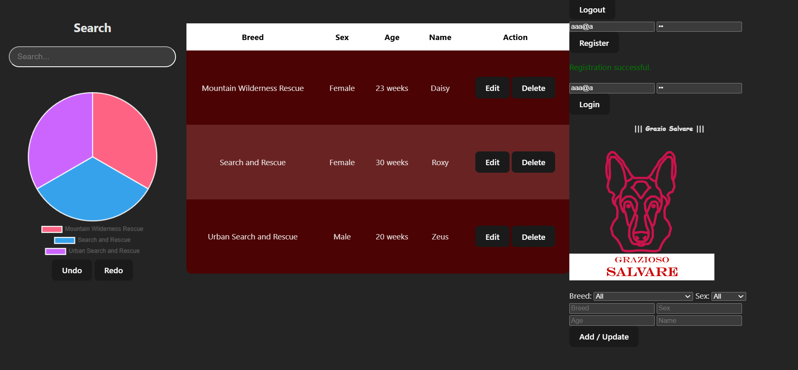

        <h1>Code Review</h1>
        <iframe width="700" height="425" src="https://www.youtube.com/embed/Fy_drKCJWU4?si=r0HRbUd_x-LhSVq2" 
                title="YouTube video player" frameborder="0" 
                allow="accelerometer; autoplay; clipboard-write; encrypted-media; gyroscope; picture-in-picture; web-share" 
                referrerpolicy="strict-origin-when-cross-origin" allowfullscreen>
        </iframe>

        <h1>Original Aritfact</h1>
        <h4>All enhancements are based on this artifact</h4>
        <a href="https://github.com/averylr25/averylr25.github.io/blob/main/Original-CS340-Artifact-Regier.zip">Github 
                Link</a>

        <h1>Enhancement 1:</h1>
        <h3>Software Design and Engineering</h3>
        <a href="https://github.com/averylr25/averylr25.github.io/blob/main/CS499-Enhancement1.zip">Github Link</a>
        </img>
        <h2>Narrative</h2>
        <h3>1.	Briefly describe the artifact. What is it? When was it created?</h3>
        <h4>
                The artifact is the Grazio Salvare React page which is an alternative 
                to the original, python-based artifact. The enhancement is a react page 
                that showcases how information can be displayed to a user and ultimately
                highlights the ability to design cohesive programs. The overall goal of this 
                process was to build a well-defined layout that can be easily added to for later 
                iterations, such as the implementation of CRUD based ideas in the table or through 
                editing the individual dogs. This artifact was originally created in 2024 and 
                enhanced in 2025.
        </h4>
        <h3>2.	Justify the inclusion of the artifact in your ePortfolio. Why did you select 
        this item? What specific components of the artifact showcase your skills and 
        abilities in software development? How was the artifact improved?</h3>
        <h4>
                This artifact will be included in the ePortfolio as it highlights the ability to 
                use multiple languages and libraries in order to make a clean and coherent project.
                I selected this item because it seemed like the most impactful for me to do as 
                being able to convert languages is an essential skill that everyone needs to know 
                due to the adaptability of Computer Science as a whole. The specific components 
                that highlight my skills is the ability to convert the python code to JavaScript 
                with similar, yet distinct, mannerisms. The artifact was improved as the UI was made to look better as well 
                as allowing for a more solidified filtration system compared to the original.
        </h4>
        <h3>3.	Reflect on the process of enhancing and modifying the artifact. What did you learn as you were creating it 
                and improving it? What challenges did you face?</h3>
        <h4>
                The biggest issue for me was time constrains, which will likely be a running theme, as I had been struggling 
                in another class whilst taking this one which 
                reduced the overall time for planning. Additionally, I had no knowledge of React 
                and very limited knowledge of CSS and HTML which had caused me to have to learn as 
                I go. Accordingly, this lack of knowledge had allowed me to further learn both html 
                and css more which gives me confidence for later iterations of this project. 
                Otherwise, to combat this lack of knowledge, a lot of research had to be done such 
                as the implementation of tables and CRUD features in order to make the project run better.</h4>

        <h1>Enhancement 2:</h1>
        <h3>Algorithms and Data Structures</h3>
        <a href="https://github.com/averylr25/averylr25.github.io/blob/main/CS499-Enhancement2.zip">Github Link</a>
        </img>
        <h2>Narrative</h2>
        <h3>1.	Briefly describe the artifact. What is it? When was it created?</h3>
        <h4>
                This artifact is the stack redo/undo enhancement based on the React enhancement. The original artifact was a 
                CRUD based python project which allowed the users to easily iterate and manage data which was originally 
                created in 2024. This new artifact, created in 2025, aims to solve ones of the main issues with databases, 
                human error. The implementation of the undo/redo will allow users to track back on any mistakes they may 
                make through the program recording instances and allowing for the user to either go back, or forward with 
                their actions.
        </h4>
        <h3>2.	Justify the inclusion of the artifact in your ePortfolio. Why did you select 
        this item? What specific components of the artifact showcase your skills and 
        abilities in software development? How was the artifact improved?</h3>
        <h4>
                While the total enhancements can be improved, the undo/redo using the stack allows for the CRUD features to 
                be more user friendly as they can fix potential errors they may have committed. I selected this item because 
                I wanted to build one bigger project rather than three separate ones in order to showcase a “larger” scale 
                upgrade and being able to undo/redo is one of the more important UI/UX features. The ability to use the 
                stack to undo/redo errors shows the ability to use the data structure to provide a more user-friendly feel 
                to the project which shows the ability to understand how data structures work. 
        </h4>
        <h3>3.	Reflect on the process of enhancing and modifying the artifact. What did you learn as you were creating it 
                and improving it? What challenges did you face?</h3>
        <h4>
                The biggest challenge for me was finding a way to improve the data structure/algorithms for the project 
                since my initial plan did not properly cover the goals of the course. Contrastingly, in development, the 
                main issue I faced was being unable to find a good way to store past states for the undo/redo events to work 
                properly. Once I found a solid way to implement these designs, the changes were relatively easy. I learned 
                through this enhancement how to properly apply logic to a program that allows for the states to be called 
                upon and altered.
        </h4>

        <h1>Enhancement 3:</h1>
        <h3>Databases</h3>
        <a href="https://github.com/averylr25/averylr25.github.io/blob/main/CS499-Enhancement3.zip">Github Link</a>
        </img>
        <h2>Narrative</h2>
        <h3>1.	Briefly describe the artifact. What is it? When was it created?</h3>
        <h4>
                The artifact being enhanced is the CS340 Grazio Salvares CRUD that was also the targeted artifact in the     
                previous enhancements which was developed in 2024. The enhancement, developed in 2025, is an attempt at a 
                MERN stack application which allows users to alter, login, and view information from a database.
        </h4>
        <h3>2.	Justify the inclusion of the artifact in your ePortfolio. Why did you select 
        this item? What specific components of the artifact showcase your skills and 
        abilities in software development? How was the artifact improved?</h3>
        <h4>
                I had selected this project because full stack development is one of the areas that interested me the most.I 
                am leaning more towards a career in game development, but full stack was another option that I had taken 
                interests in. I feel as though I did alright with creating this application, though there are clear errors 
                such as the lack of modularization, but the overall foundation and operability is there. The ability to 
                connect a database with the project shows the ability to enhance and alter code shows strength in the 
                ability to work with databases as a whole as connecting the frontend operation to the backend operations 
                takes a lot of work to accomplish. I was able to connect to a database, implement features that should alter 
                the database, and cleaned up previous issues which all show the ability to work with and manage databases. I 
                was able to make the data display on my table which shows strength in ideas like data analysis as being able 
                to iterate and read large amounts of data is a needed skill.. This artifact was improved as it was converted 
                into a complete full-stack application which allows for the dynamic usage of data 
        </h4>
        <h3>3.	Reflect on the process of enhancing and modifying the artifact. What did you learn as you were creating it 
                and improving it? What challenges did you face?</h3>
        <h4>
                My main issue was yet again time constraints as I had done somewhat poor during the planning phase which led 
                to me being a bit lost on how to start this enhancement. Despite this, I learned a lot about building a 
                project from scratch, such as using libraries to help with the foundations of a program, the importance of 
                organized code, and the usefulness of online resources such as official MongoDB documentation to see how to 
                properly connect my front/back-end data. The hardest part for me was understanding how to actually get the 
                project to work, which took a long time for me to begin to understand. However, as I began coding more and 
                more, I began to increasingly understand the concepts which led to the final completion of the enhancement.
        </h4>

